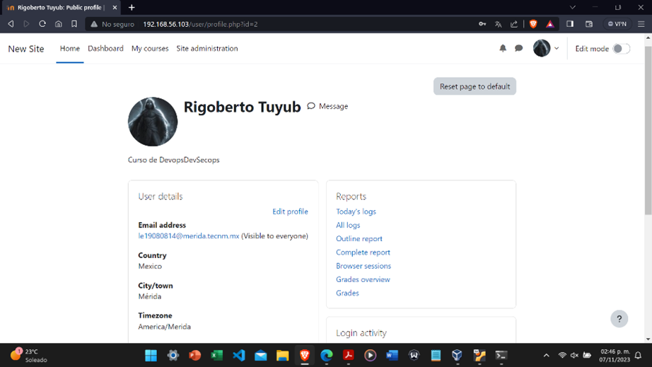
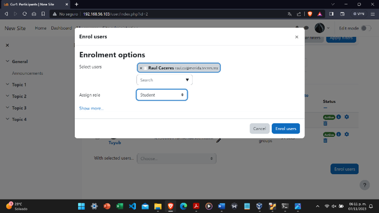

# Ejecutar Moodle mediante docker compose

# Ejecutar localmente usando docker 

1. Ejecutar los siguientes comandos:

   $ git clone https://github.com/Tuyub22/MoodleRJ.git
   $ cd MoodleRJ/

2. Levantar los contenedores

  $ docker-compose up 

# Paso 1. Login en moodle 

  - Usuario: user
  - Contraseña: bitnami

  

# Paso 2. Personalizar perfil

  La personalizacion es a gusto de cada uno. Ejemplo:

  

# Paso 3. Creacion de un curso

  En este caso el curso se llama "Curso 1".

  

# Paso 4. Visualizacion

  Visualizacion del curso creado.

  

# Paso 5. Creacion de nuevos usuarios

  Se pueden crear nuevos usuarios y ponerles contraseñas
  
  

# Paso 6. Confirmar que todos los usuarios esten creados

  Los usuarios creados apareceran de la siguiente manera:
  
  

# Paso 7. Asignacion de roles

  Los usuarios creados apareceran de la siguiente manera:
  
  

# Paso 8. Ver todos los usuarios agregados al curso con sus diferentes roles

  Se deberia ver de la siguiente forma:
  
  

Repositorio para Devops, actividad de moodle. Hecho por Rigoberto Tuyub y Jorge Caamal
